<h1 align="center">👨‍💻 Lucas Fortuna</h1>

  <b>Software Engineering Student | Developer | Technology Enthusiast</b>

  Software Engineering student at the Catholic University of Brasília. 
  Currently working at the Legislative Assembly of the Federal District. 
  Studying and developing projects with Java, Python, JavaScript, TypeScript and other technologies.

  

  

  

  

 

<h2>🛠️ Languages and Technologies</h2>

  
  

  
  

  
  

  
  

  
  

  
  

  
  

  
  

  
  

  
  

  
  

  
  

  
  

  

 

<h2>📊 Statistics</h2>

  
  

 

<h2>🐍 Contributions</h2>

  <picture>
    <source
      media="(prefers-color-scheme: dark)"
      srcset="https://raw.githubusercontent.com/LucasF89k/LucasF89k/output/snake-dark.svg"
    />

    <source
      media="(prefers-color-scheme: light)"
      srcset="https://raw.githubusercontent.com/LucasF89k/LucasF89k/output/snake.svg"
    />

    
  </picture>

